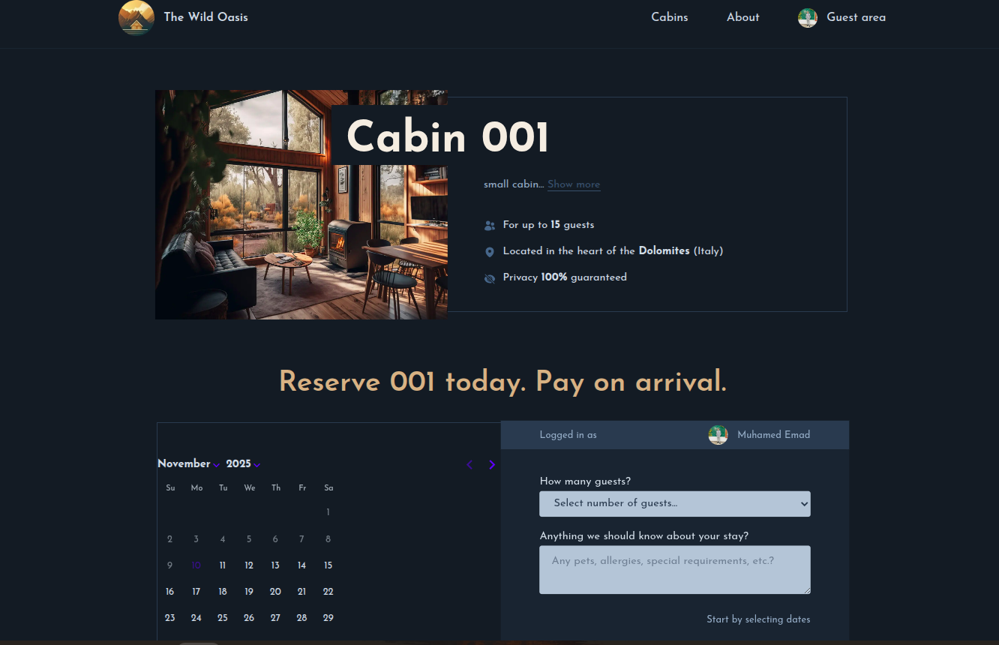
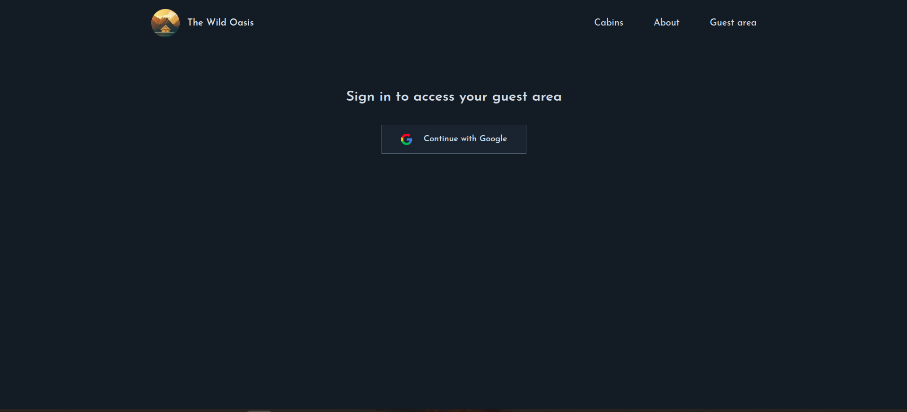

# The Wild Oasis

Welcome to **The Wild Oasis** – a serene getaway in nature, built with [Next.js](https://nextjs.org). This project is a full-featured web application for booking luxury cabins in the heart of the Italian Dolomites.

Toy can try it from here : https://the-wild-oasis-website-sooty-seven.vercel.app/
## Features

- **Cabin Listings:** Browse all available cabins with detailed descriptions and photos.
- **Advanced Filtering:** Filter cabins by capacity (small, medium, large).


- **Cabin Details:** View amenities, pricing, and availability for each cabin.
- **Reservation System:** Select dates, number of guests, and make reservations.


- **User Authentication:** Sign in with Google to access your guest area.


- **Profile Management:** Update your guest profile and nationality.


- **Reservation Management:** View, edit, and delete your reservations.
- **Optimistic UI:** Fast, responsive updates for reservation actions.
- **Loading & Error States:** Friendly spinners and error messages for smooth UX.
- **Responsive Design:** Beautiful on desktop and mobile.


## Getting Started

First, run the development server:

```bash
npm run dev
# or
yarn dev
# or
pnpm dev
# or
bun dev
```

Open [http://localhost:3000](http://localhost:3000) in your browser.

## Project Structure

- `app/` – Main Next.js app directory (pages, components, styles)
- `photos/` – Screenshots and cabin images
- `public/` – Static assets
- `starter/` – Starter code and legacy components

## Technologies

- Next.js 15
- React 19
- Supabase (database & auth)
- Tailwind CSS
- date-fns
- NextAuth.js

## Learn More

- [Next.js Documentation](https://nextjs.org/docs)
- [Learn Next.js](https://nextjs.org/learn)

---

Enjoy your stay at The Wild Oasis!
